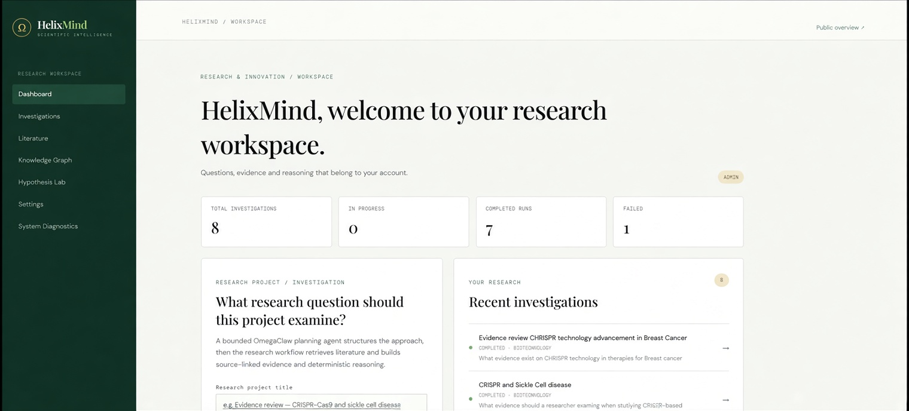
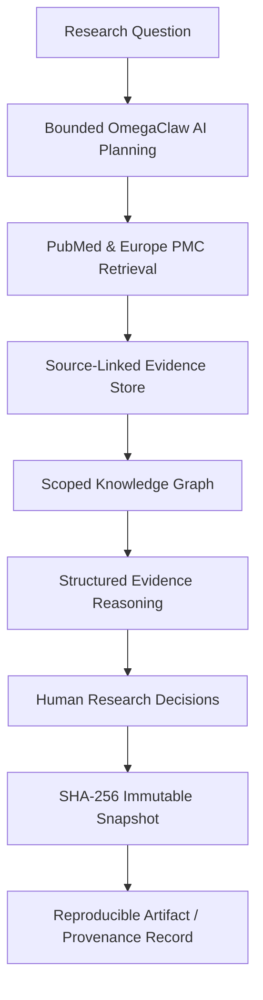

<p align="center">
  
</p>

<h1 align="center">HelixMind</h1>

<p align="center"><strong>An auditable AI infrastructure layer for Research &amp; Innovation.</strong></p>

<p align="center">
  <a href="https://helix-mind-green.vercel.app/">Live demo</a> ·
  <a href="docs/HELIXMIND_PROJECT_DOCUMENTATION.md">Project documentation</a> ·
  <a href="CONTRIBUTING.md">Contributing</a> ·
  <a href="LICENSE">MIT License</a>
</p>

> HelixMind turns AI-assisted research into a traceable workflow where literature, evidence, reasoning, researcher decisions, and reproducible outputs remain connected.


## What HelixMind does

An **Investigation** is the research project primitive. A researcher starts with a question, and bounded OmegaClaw-powered planning turns it into inspectable research objectives and literature queries. HelixMind retrieves publications from PubMed and Europe PMC and keeps evidence linked to its publication and source text.

The system organizes extracted knowledge in an investigation-scoped graph and applies deterministic evidence reasoning. Researchers can explicitly save scoped research decisions as persistent memory. Research runs retain parent/child lineage and freeze into immutable SHA-256 snapshots; reports and structured exports are generated from those snapshots, so outputs remain tied to a specific research state.

AI plans are planning inputs, not evidence. Reasoning outputs expose their evidence and uncertainty. The workflow keeps researcher decisions explicit and makes the resulting artifacts reproducible and inspectable.

## Core workflow

```text
Research Question
        ↓
Bounded AI Planning
        ↓
PubMed + Europe PMC
        ↓
Source-linked Evidence
        ↓
Knowledge Graph
        ↓
Structured Evidence Reasoning
        ↓
Human Research Decision
        ↓
Immutable Snapshot
        ↓
Reproducible Research Artifact
        ↓
Private Scientific Asset / Provenance Record
```

1. A researcher creates an owner-scoped Investigation and supplies the research question and context.
2. Bounded OmegaClaw planning proposes structured objectives and queries. Provider/model attribution and any deterministic fallback are recorded.
3. PubMed and Europe PMC provide real literature records. HelixMind stores source metadata, retrieval context, and evidence links.
4. Deterministic extraction and validated semantic candidates contribute to the investigation knowledge graph. Structured reasoning records hypotheses, contradictions, gaps, and traces from stored evidence.
5. Researchers choose whether to save explicit Human Research Decisions. Eligible memory is scoped to the owner and Investigation and recorded when applied to a later run.
6. Completed runs produce immutable SHA-256 snapshots. Deterministic comparisons and snapshot-bound artifacts preserve the research state used to create each output.
7. From an Investigation, reviewers can open Literature landscape for semantic-extraction candidates, and Scientific IP / Provenance for private asset versions bound to completed snapshots and artifacts. Local/test anchor references are explicitly not external proof.

## Why it is different

### Evidence-first

Retrieved literature remains the evidence source of truth; a generated plan is not evidence.

### Provenance-first

Claims and evidence remain linked to source publications and available source text.

### Human-controlled memory

Researchers create explicit, scoped decisions. Memory application is recorded and inspectable.

### Reproducibility

Runs produce immutable SHA-256 snapshots, deterministic comparisons, and artifacts generated from frozen snapshot manifests.

### AI as infrastructure

Planning is bounded, attributed, and observable. The agent supports a workflow; it is not treated as an authority on scientific truth.

## Live research demonstration

The demonstration follows a CRISPR-Cas9 / sickle-cell research question through planning, PubMed and Europe PMC retrieval, source-linked evidence, graph and reasoning outputs, semantic extraction, researcher memory, reproducible snapshots, and the contextual Scientific Asset / Provenance screen at `/investigations/{id}/assets`. It exercises the infrastructure with a real literature workflow rather than presenting the scientific domain as the product category.

At the accepted M5 semantic-extraction checkpoint, the isolated workflow contained 20 canonical publications and 162 source-linked evidence records. A bounded semantic-extraction run processed 20 evidence rows from three publications; one candidate passed deterministic validation and was projected as a source-linked relationship. The source snapshot remained valid and unchanged, and the post-projection snapshot digest validated. These are checkpoint results, not guarantees about future provider availability.

> CRISPR/sickle-cell is the demonstration domain used to exercise the infrastructure. HelixMind is not a clinical system and does not provide diagnosis or treatment recommendations.

## Architecture


  

**Representation boundary:** PostgreSQL is canonical. HelixMind projects structured knowledge into MeTTa and validates that representation with PeTTa. This is not a claim that MeTTa or PeTTa runs the production evidence-reasoning pipeline. A separate fixed NAL/PLN proof is a technical demonstration, not the literature reasoning engine.

See [Architecture and system boundaries](docs/HELIXMIND_PROJECT_DOCUMENTATION.md#7-architecture) for the detailed view.

## Core capabilities

- Authenticated, owner-scoped research Investigations
- Bounded OmegaClaw research planning and real PubMed / Europe PMC retrieval
- Source-linked evidence and provenance-aware knowledge graph
- Deterministic structured evidence reasoning and a bounded semantic-extraction pilot
- Persistent, human-controlled ResearchMemory
- Parent/child run lineage, immutable SHA-256 snapshots, deterministic comparison
- Snapshot-bound Markdown, structured scientific report, and Obsidian-compatible artifacts
- MeTTa knowledge projection and PeTTa validation
- Private scientific asset and provenance foundation

## Verification

Latest supplied verification record (C2B, 2026-10-01): isolated PostgreSQL test database upgraded to migration head `c2a1b2c3d4e5`; **86 backend tests passed**; **11 focused C1/C2 checks passed**; frontend production build and migration verification passed; and `git diff --check` passed. No production database or service was changed. The C2B strategy and its unresolved provider decision are documented in [the C2B report](docs/C2B_PRODUCTION_PROVENANCE_STRATEGY.md).

The accepted M5 report records a real research workflow, valid snapshot checks, semantic-extraction acceptance, isolated database use, and a frontend build. Verification is point-in-time; external AI and literature providers can change availability.

## Scientific boundaries

- Retrieved literature is the evidence source of truth; AI plans are not evidence.
- Evidence confidence is an evidence-system assessment, not scientific truth or clinical probability.
- Hypotheses are qualified research states. A missing result is not evidence of absence.
- HelixMind is not a clinical decision system, and researchers remain responsible for scientific interpretation.

See [Scientific reasoning and limitations](docs/SCIENTIFIC_REASONING.md).

## Scientific IP asset provenance

**Implemented:** private scientific asset records, immutable asset versions tied to research snapshots and artifacts, researcher-entered rights declarations, provenance checks, asset audit events, and a deterministic local/test provenance-anchor foundation. The anchor implementation is not external proof. C2B defines a production strategy, but a production-capable external provenance provider remains unresolved.

**Future adapter layer:** external provenance provider, BASIX.Market or another registry/marketplace integration, ownership or co-ownership synchronization, licensing workflow, token issuance, and production external anchoring. HelixMind does not claim blockchain anchoring, NFT minting, BASIX integration, live tokenization, or marketplace operation. It does not call the CRISPR gene a tokenized asset; a future asset could be a provenance-backed digital research/IP artifact and its declared rights representation.

HelixMind's scientific asset and provenance model creates a natural adapter boundary for future ownership and marketplace ecosystems such as BASIX.Market. This describes a potential future connection, not an implemented integration. See [C0](docs/C0_SCIENTIFIC_IP_ASSETIZATION.md), [C1](docs/C1_PRIVATE_PROVENANCE_RIGHTS_FOUNDATION.md), [C2](docs/C2_EXTERNAL_PROVENANCE_ANCHOR.md), and [C2B](docs/C2B_PRODUCTION_PROVENANCE_STRATEGY.md).

## Track 4 alignment

The official Track 4 (Advanced) brief is **Build the AI Infrastructure Layer** using SingularityNET's Omega agent infrastructure / Hyperon AGI stack to build practical tools for universities, businesses, and community ecosystems. Its options include Dev/Scale Support, Fractional CTO Agent, and RWA / Digital Asset Infrastructure. HelixMind does not claim to implement every option.

**Primary:** AI infrastructure for auditable, persistent, reproducible research.<br>
**Secondary:** scientific IP asset provenance and rights infrastructure that can support future digital-asset or marketplace workflows.

The CRISPR-Cas9 / sickle-cell workflow is the demonstration domain. The Track 4 narrative is: research question → Omega-powered bounded planning → real literature → source-linked evidence → structured knowledge → evidence reasoning → Human Research Memory → immutable research state → reproducible artifact → scientific IP asset and provenance. This demonstrates how agent infrastructure can support persistent, auditable institutional research workflows. Broader RWA and marketplace operations remain future scope; the scientific asset/provenance foundation is implemented.

## Technology

Next.js / TypeScript · FastAPI / Python · PostgreSQL · Redis / RQ · OmegaClaw · MeTTa / PeTTa · PubMed · Europe PMC · Codex · Vercel + VPS deployment.

## Quick start

Requirements: Node.js 20+, Python 3.12+, PostgreSQL, and Redis. Configure local environment values using [`backend/.env.example`](backend/.env.example); use dedicated development services.

```bash
npm install
npm run dev
```

For the API, worker, database migrations, and provider configuration, follow the [local setup guide](docs/HELIXMIND_PROJECT_DOCUMENTATION.md#quick-start-and-operation-notes). Do not point development migrations at production resources.

## Repository structure

```text
app/                 Next.js research workspace
backend/             FastAPI API, worker, migrations, and tests
docs/                Project, architecture, research, and acceptance documentation
backend/tests/       Backend API, isolation, and workflow verification
deploy/              HelixMind deployment configuration and examples
```

## Documentation

- [Project documentation](docs/HELIXMIND_PROJECT_DOCUMENTATION.md)
- [Architecture and infrastructure](docs/INFRASTRUCTURE.md)
- [Literature pipeline](docs/LITERATURE_PIPELINE.md) · [Knowledge layer](docs/KNOWLEDGE_LAYER.md) · [Knowledge Graph 2.0](docs/KNOWLEDGE_GRAPH_2.0.md)
- [Scientific reasoning](docs/SCIENTIFIC_REASONING.md) · [Research artifacts](docs/RESEARCH_ARTIFACTS.md)
- [OmegaClaw runtime](docs/OMEGACLAW_RUNTIME.md) · [Inference providers](docs/INFERENCE_PROVIDERS.md)
- [M5 semantic extraction acceptance](docs/M5_SEMANTIC_EXTRACTION_PILOT.md) · [M4 literature acceptance](docs/M4_LITERATURE_INTELLIGENCE_2.0_REPORT.md)
- [C0 scientific assetization](docs/C0_SCIENTIFIC_IP_ASSETIZATION.md) · [C1 provenance and rights](docs/C1_PRIVATE_PROVENANCE_RIGHTS_FOUNDATION.md) · [C2 external provenance](docs/C2_EXTERNAL_PROVENANCE_ANCHOR.md) · [C2B production strategy](docs/C2B_PRODUCTION_PROVENANCE_STRATEGY.md)
- [Infrastructure operations](docs/INFRASTRUCTURE.md) · [Contributing](CONTRIBUTING.md)

## Roadmap status

| Area | Status |
| --- | --- |
| Core research infrastructure | Complete |
| Knowledge graph | Complete |
| Literature intelligence | Complete |
| Semantic extraction | Complete (bounded pilot) |
| Scientific asset provenance | Foundation complete |
| External production provenance | Strategy complete; provider unresolved |
| Licensing operations | Future |
| Marketplace / registry adapter | Future |
| Commercial / tokenization layer | Future |
| M6 / M7 | Deferred |
| ERN-AI | Outside core roadmap |


## Contributing and license

See [CONTRIBUTING.md](CONTRIBUTING.md) for setup, engineering boundaries, and contribution guidance. HelixMind is released under the [MIT License](LICENSE).
